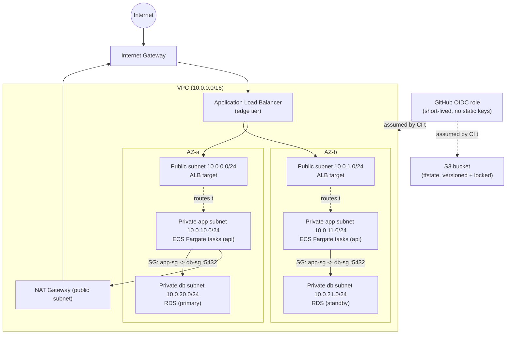

# AWS Architecture Design (design-only, Path A add-on)

No deployment here — this is the required design-only piece for Path A.
The goal is to show the same three-tier isolation reasoning holds up on
real AWS, not just as a Docker trick.

## Diagram

Same thing as Mermaid, in case the rendered image doesn't come through:

## How the local setup maps onto this

| Local (Path A)                            | AWS                                                                   |
|--------------------------------------------|-------------------------------------------------------------------------|
| `edge_net` Docker network + published port | Public subnets (2+ AZs) + Internet Gateway + ALB                       |
| `app_internal` Docker network               | Private "app" subnets + `app-sg` security group                        |
| `db_internal` Docker network                | Private "db" subnets + `db-sg` security group                          |
| `nginx` container                           | Application Load Balancer (or an Nginx/Envoy sidecar, if we kept compute) |
| `api` container(s)                          | ECS Fargate service (or an EKS Deployment) in the private app subnets  |
| `postgres` container                        | RDS for PostgreSQL, Multi-AZ, private db subnets, no public access     |
| MinIO `tfstate` bucket + `use_lockfile`     | S3 bucket, versioned, S3-native conditional-write locking (or DynamoDB if the Terraform/CI version doesn't support that) |
| `TF_VAR_db_password` GitHub secret          | AWS Secrets Manager or SSM Parameter Store (SecureString), injected into the ECS task def — not a GitHub secret for anything the running app needs |
| CI runner using the local Docker socket     | GitHub OIDC → short-lived `AssumeRoleWithWebIdentity` into a repo/branch-scoped IAM role, no long-lived AWS keys anywhere |

## DB isolation on AWS — how you'd enforce and check it

**Enforcement:** RDS sits in the private db subnets, `PubliclyAccessible =
false`, and its security group (`db-sg`) has exactly one ingress rule:
TCP/5432 from `app-sg`, referenced by security group ID, not a CIDR block.
The ALB's security group is never in `db-sg`'s ingress list — same idea as
nginx never joining `db_internal` locally. Route tables back this up too:
the db subnets have no route to the Internet Gateway, so there's no path
out even if the security group were misconfigured.

**How you'd verify it** (the AWS equivalent of `scripts/verify-isolation.sh`):
- `aws ec2 describe-security-groups` on `db-sg` — the only ingress source
  should be `app-sg`'s group ID, nothing referencing `0.0.0.0/0` or the
  ALB's security group.
- A connectivity check from inside a running api task
  (`aws ecs execute-command` → `nc -zv <rds-endpoint> 5432`, should
  succeed), and the same check from a task sitting in the public subnet
  with the ALB's security group attached (should time out or get
  refused) — basically the same two-probe pattern as the local
  `VERIFY.md`, just run against real AWS APIs instead of `docker exec`.

## What changes if I actually built this on AWS

The module (`modules/app-stack`) is built around network topology and
tier relationships, not around Docker specifically, so retargeting it
isn't a rewrite:

- Swap `provider "docker"` for `provider "aws"`. The module's inputs
  (`environment`, replica count, memory/CPU sizing, `db_password`) stay
  basically the same.
- Replace the `docker_network` resources with `aws_subnet` +
  `aws_route_table` pairs (public vs private) and an `aws_security_group`
  per tier.
- Replace `docker_container.postgres` with `aws_db_instance`; replace
  `docker_container.api` with `aws_ecs_service` + `aws_ecs_task_definition`
  (or a Kubernetes Deployment on EKS); replace `docker_container.nginx`
  with `aws_lb` + `aws_lb_target_group` + `aws_lb_listener`.
- What actually carries over is the shape — three tiers, one
  network/subnet-group per tier, the db tier only reachable from the
  compute tier by construction. Docker containers vs. AWS-managed services
  is just a provider detail. None of the isolation logic depends on
  anything Docker-specific — it only depends on "network membership
  determines reachability," and subnets + security groups give you that
  exact same guarantee.
