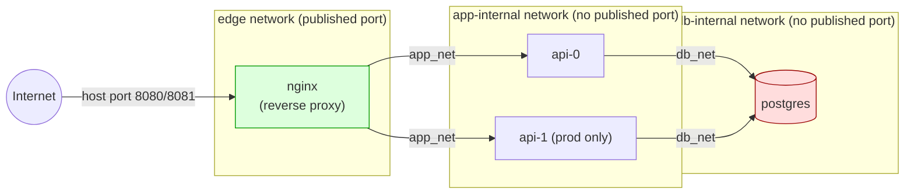
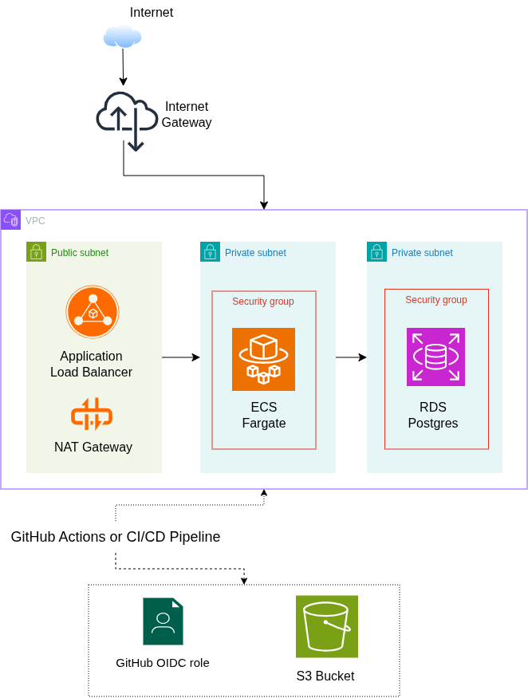

# Multi-Environment IaC — Docker + Terraform (Path A)

This is my submission for the DevOps home assignment: a network-isolated,
multi-service app that gets deployed twice — staging and production — from
one Terraform module, with remote state, locking, and a CI/CD pipeline that
won't apply anything without a human clicking approve first.

I went with Path A: everything runs locally, Docker + Terraform + MinIO
standing in for S3. `AWS_DESIGN.md` covers the required Path A add-on — no
actual AWS deployment, just the same architecture mapped onto real AWS
primitives with the reasoning written out.

## Architecture



The core decision here is three Docker networks per environment, not two:

| Network        | Members       | Published port? |
|----------------|---------------|------------------|
| `edge_net`     | nginx only    | Yes (host)       |
| `app_internal` | nginx, api    | No               |
| `db_internal`  | api, postgres | No               |

nginx is never put on `db_internal`. That's the whole trick — there's no
firewall rule guarding Postgres that someone could get wrong, nginx simply
isn't on the network Postgres lives on, so there's no path there at all.
It's the same idea as splitting a VPC into a public subnet and two private
subnets with different security groups; I walk through that mapping
properly in `AWS_DESIGN.md`.

Here's what the same stack looks like if it were actually deployed on AWS
(design-only, no deployment — see `AWS_DESIGN.md` for the full mapping):



## Repo layout

```
modules/app-stack/       # one reusable module: networks + nginx + api + postgres
environments/staging/    # calls the module with staging-sized inputs
environments/production/ # calls the module with production-sized inputs
.github/workflows/       # pr-plan.yml (plan+comment), apply.yml (gated apply)
scripts/                 # bootstrap-backend.sh, verify-isolation.sh
Makefile                 # local dev shortcuts
VERIFY.md                # proof-of-isolation walkthrough
AWS_DESIGN.md             # Path A add-on: AWS design mapping, no deployment
```

## Running it locally

You need Docker, Terraform >= 1.11, and the MinIO client (`mc`). If you
don't already have `mc`, grab the binary directly:

```bash
curl -fL -o mc https://dl.min.io/client/mc/release/linux-amd64/mc
chmod +x mc
sudo mv mc /usr/local/bin/   # or just leave it somewhere on your PATH
```

(the `-L` matters — without it, `curl` just saves you the redirect page,
not the actual binary. Found that out by trying to run an HTML file.)

Then, from the repo root:

```bash
# 1. bring up MinIO — the local stand-in for S3
make minio-up

# 2. create the tfstate bucket
#    this is done with `mc`, NOT terraform. terraform can't create the
#    bucket its own state is going to live in — that's a chicken-and-egg
#    problem. mc creates it once, outside terraform, and it's safe to
#    re-run.
make bootstrap

# 3. stand up staging
make init ENV=staging
make plan ENV=staging
make apply ENV=staging

# 4. prove the isolation claim actually holds
make verify ENV=staging

# 5. do the same for production — separate state key, separate networks,
#    nothing shared with staging
make init ENV=production
make apply ENV=production
make verify ENV=production
```

Once staging is up, `curl http://localhost:8081` should get you back
`staging api 0 ok` (that's nginx proxying to the api container). Production
is on `:8080`. `/healthz` on either one should just return `ok`.

To tear it all down:

```bash
make destroy ENV=staging
make destroy ENV=production
make minio-down
```

One thing worth flagging: I run MinIO with no mounted volume, so its data —
including the tfstate bucket — doesn't survive a container restart. That's
fine for a local demo, not something I'd do for anything real. You'd want a
volume, or just point at actual S3.

**Two bugs I hit while getting this running, for the record:**
- `memory_swappiness = null` in the module wasn't a valid argument on the
  current `kreuzwerker/docker` provider version — removed it, it was a
  no-op anyway.
- The isolation verify script originally did `docker exec <container> sh -c
  "apk add netcat..."`, which works fine against nginx (Alpine-based, has a
  shell) but fails against the api container, because `hashicorp/http-echo`
  is a scratch image with no shell at all. Fixed by probing from a
  throwaway `busybox` container attached to the target's network namespace
  instead of execing into the target directly — see `VERIFY.md`.

## CI/CD

Two separate workflows, on purpose — not one workflow with an if/else:

- **`pr-plan.yml`** (runs on PRs to `main`): `terraform fmt -check`,
  `validate`, `tfsec`, spins up MinIO as a GitHub Actions service container,
  runs `plan`, and posts the output as a PR comment. It never applies
  anything.
- **`apply.yml`** (runs on push to `main`): runs `terraform apply`, but the
  job is bound to a GitHub Environment (`staging` / `production`) with
  required reviewers set in repo settings, so it pauses for a human
  approval before it can go. It can't run from a PR at all — it's not
  wired to the `pull_request` trigger, so there's no conditional to get
  wrong.

**Repo secret needed to make the pipeline actually work:**
- `TF_VAR_DB_PASSWORD` — read by Terraform as `TF_VAR_db_password`. Never
  committed anywhere in this repo.

**Action pinning:** every third-party Action is pinned to a full 40-char
commit SHA (see the `# vX.Y.Z` comments in the workflow YAML), not a
floating tag — so a compromised tag can't quietly change what CI is
running. The `minio/minio` service container in both workflows is pinned
the same way, to a real digest I pulled and verified locally
(`sha256:14cea493...bd8936e`), not a placeholder.

## Environment segregation & state + locking

- Each environment gets its own backend key
  (`staging/terraform.tfstate` vs `production/terraform.tfstate`) inside
  the same MinIO bucket. There's no code path where a staging apply could
  touch production's state — they're separate state files, not just
  separate workspaces sharing one.
- **Locking:** using the S3 backend's native `use_lockfile = true`
  (Terraform ≥ 1.11's conditional-write locking via S3 `If-None-Match`)
  instead of a DynamoDB table. Older MinIO versions without
  `If-None-Match` support will fail to acquire the lock — worth pinning a
  reasonably current MinIO image to avoid that.
- **DRY:** `modules/app-stack` is the one place the architecture is
  defined. `environments/staging/main.tf` and
  `environments/production/main.tf` are short callers that only differ on
  `edge_host_port`, `api_replica_count`, memory/CPU, and which state
  key/db password they use. Nothing is copy-pasted between the two.

## Database isolation — how it's enforced and verified

**Enforced:** `postgres` is only attached to `db_internal`. `nginx` is only
attached to `edge_net` and `app_internal`. Docker networks are separate
L2/L3 domains by default, so a container with no attachment to a network
has no route to anything on it — there's nothing to misconfigure, the
absence of a `networks_advanced` block on nginx *is* the control.

**Verified:** `scripts/verify-isolation.sh <env>` runs a connectivity probe
against `postgres:5432` — from the api container's network (expected:
reaches it) and from nginx's network (expected: doesn't). See `VERIFY.md`
for the actual mechanics and sample output. `make verify ENV=staging`
wraps this.

## Secrets

`db_password` has no default anywhere in the module or environment
configs, so Terraform refuses to plan without it. Locally it comes in via
`TF_VAR_db_password` (the Makefile falls back to a dev-only placeholder if
you don't set it). In CI it comes from the `TF_VAR_DB_PASSWORD` repo
secret. Nothing sensitive is committed anywhere.

## Where I stopped / what I'd do next

This covers the full Path A build plus the required design-only AWS
mapping. Given more time, in priority order:

1. Add `tflint` alongside `tfsec` for provider-specific lint rules.
2. Swap `http-echo` for a real minimal API that actually talks to
   Postgres — right now the api container gets DB env vars but never uses
   them. Fine for proving network reachability, not for proving the data
   tier actually works end to end.
3. Stretch goal: swap the Docker provider for local `kind` + real
   `NetworkPolicy` objects, so the isolation claim gets enforced and
   verified at the Kubernetes API level instead of by "this container
   just isn't attached to that network."
