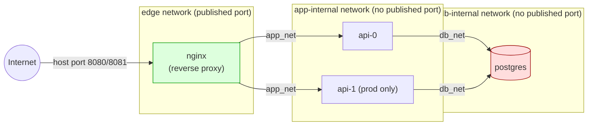

# Multi-Environment IaC — Docker + Terraform (Path A)

This is my submission for the DevOps home assignment: a network-isolated,
multi-service app that gets deployed twice — staging and production — from
one Terraform module, with remote state, locking, and a CI/CD pipeline that
won't apply anything without a human clicking approve first.

I went with Path A: everything runs locally, Docker + Terraform + MinIO
standing in for S3. `AWS_DESIGN.md` covers the required Path A add-on — no
actual AWS deployment, just the same architecture mapped onto real AWS
primitives with the reasoning written out.

## Architecture



The core decision here is three Docker networks per environment, not two:

| Network        | Members       | Published port? |
|----------------|---------------|------------------|
| `edge_net`     | nginx only    | Yes (host)       |
| `app_internal` | nginx, api    | No               |
| `db_internal`  | api, postgres | No               |

nginx is never put on `db_internal`. That's the whole trick — there's no
firewall rule guarding Postgres that someone could get wrong, nginx simply
isn't on the network Postgres lives on, so there's no path there at all.
It's the same idea as splitting a VPC into a public subnet and two private
subnets with different security groups; I walk through that mapping
properly in `AWS_DESIGN.md`.

Here's what the same stack looks like if it were actually deployed on AWS
(design-only, no deployment — see `AWS_DESIGN.md` for the full mapping):


## Repo layout

```
modules/app-stack/       # one reusable module: networks + nginx + api + postgres
environments/staging/    # calls the module with staging-sized inputs
environments/production/ # calls the module with production-sized inputs
.github/workflows/       # pr-plan.yml (plan+comment), apply.yml (gated apply)
scripts/                 # bootstrap-backend.sh, verify-isolation.sh
architecture/             # AWS design diagram (Path A add-on)
Makefile                 # local dev shortcuts
VERIFY.md                # proof-of-isolation walkthrough
AWS_DESIGN.md             # Path A add-on: AWS design mapping, no deployment
```

## Running it locally

You need Docker, Terraform >= 1.11, and the MinIO client (`mc`). If you
don't already have `mc`, grab the binary directly:

```bash
curl -fL -o mc https://dl.min.io/client/mc/release/linux-amd64/mc
chmod +x mc
sudo mv mc /usr/local/bin/   # or just leave it somewhere on your PATH
```

(the `-L` matters — without it, `curl` just saves you the redirect page,
not the actual binary. Found that out by trying to run an HTML file.)

Then, from the repo root:

```bash
# 1. bring up MinIO — the local stand-in for S3
make minio-up

# 2. create the tfstate bucket
#    this is done with `mc`, NOT terraform. terraform can't create the
#    bucket its own state is going to live in — that's a chicken-and-egg
#    problem. mc creates it once, outside terraform, and it's safe to
#    re-run.
make bootstrap

# 3. stand up staging
make init ENV=staging
make plan ENV=staging
make apply ENV=staging

# 4. prove the isolation claim actually holds
make verify ENV=staging

# 5. do the same for production — separate state key, separate networks,
#    nothing shared with staging
make init ENV=production
make apply ENV=production
make verify ENV=production
```

Once staging is up, `curl http://localhost:8081` should get you back
`staging api 0 ok` (that's nginx proxying to the api container). Production
is on `:8080`. `/healthz` on either one should just return `ok`.

To tear it all down:

```bash
make destroy ENV=staging
make destroy ENV=production
make minio-down
```